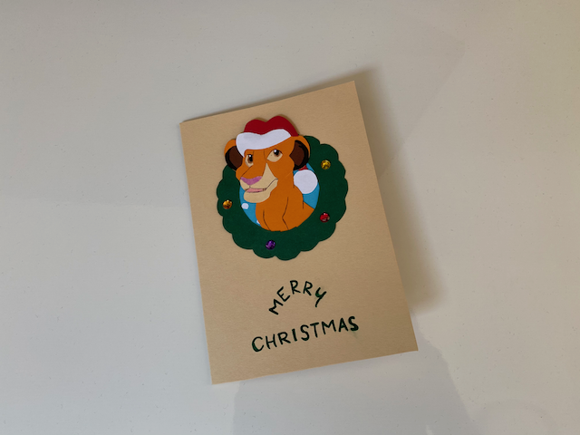
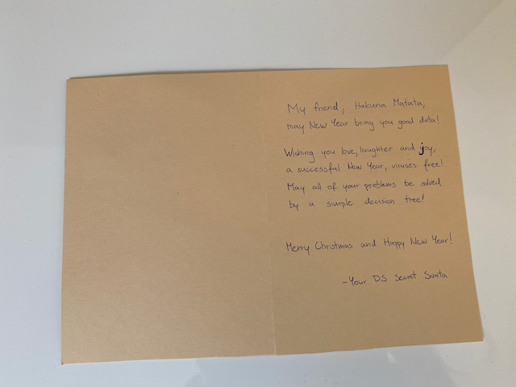
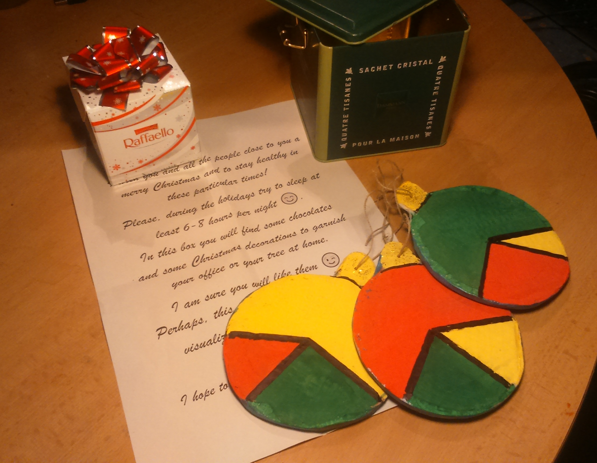

# DataScience Secret Santa 2020 - FINAL REPORTS
Hello everybody! 🙃
If you have noticed increased activity of postmen in your neighborhood, with 99% certainty we can say that's because you're just recieving your greeting cards/gifts for the 2020 Data Science Secret Santa.🥳🎆🎇
However, if you have received your gifts early this year, and if you are willing to share with the rest of DataScience group, check out `upload_your_photos.md` to learn how to do it.
[Github collaboration instructions](https://github.com/VukMNE/DataScience-Secret-Santa/blob/master/upload_your_photos.md)

Or, you can upload them to this [Google Drive folder](https://drive.google.com/drive/folders/1im8frKGNGXJ_ngh-kfc6Lw01XRxRe6wV?usp=sharing).

Feel free to also edit this markdown file and add your photos below so we can aggregate them here!
Cheers!🥳

# YOUR REPORTS

## Slavko Zitnik
Thanks for organizing this and especially to the one who created and sent this card ;) 

## Erik Štrumbelj
Thanks to my Secret Santa for a wonderful gift! And to the organizers for their work!

Feedback:

* Rafaello: Great! (You know your audience!)
* Sure, they are only pie charts, but even they deserve better color choice!
* Packaging: Perfectly sized and robust!
* Text: Don't use "at least" with an interval (*at least 6-8* makes no sense; use *at least 6* instead).

## YOUR NAME HERE
oops, nobody here yet. Feel free to add your own photo and write a comment! Apply some markdown magic to have your photos show here!

## YOUR NAME HERE
oops, nobody here yet. Feel free to add your own photo and write a comment! Apply some markdown magic to have your photos show here!
