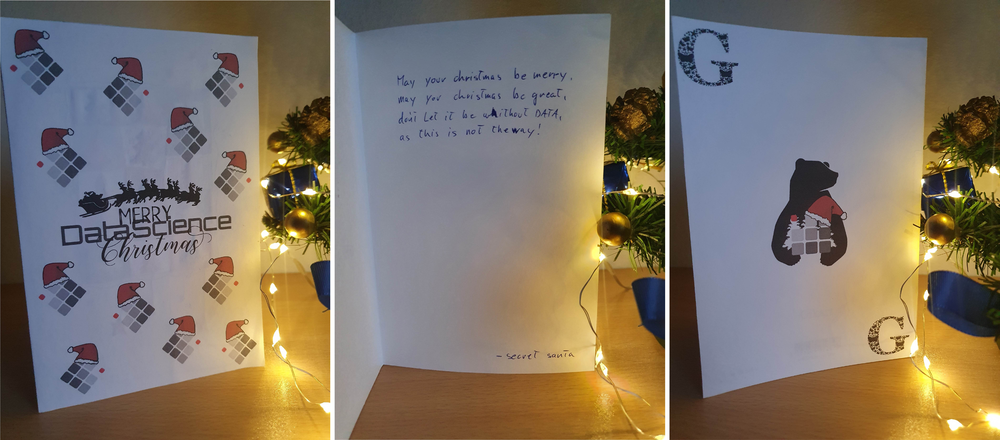
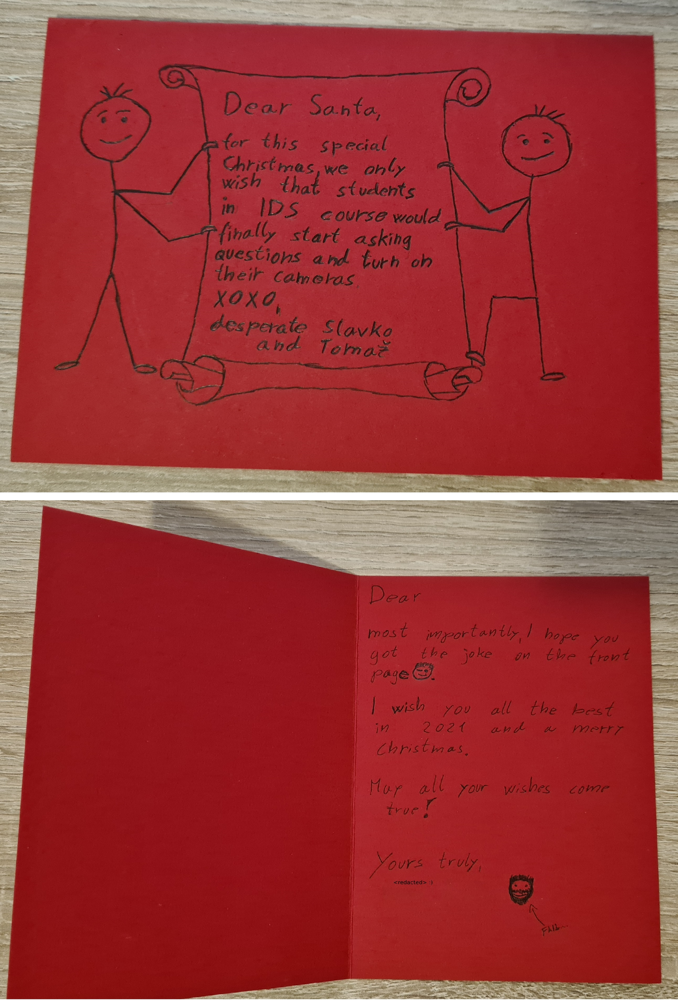
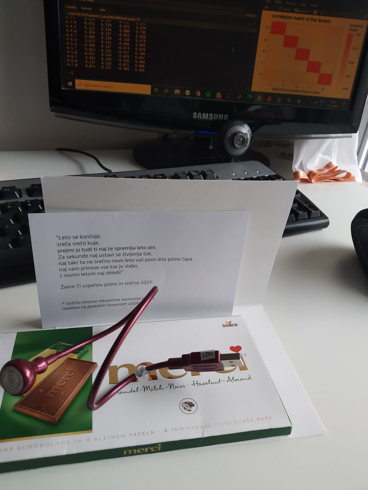
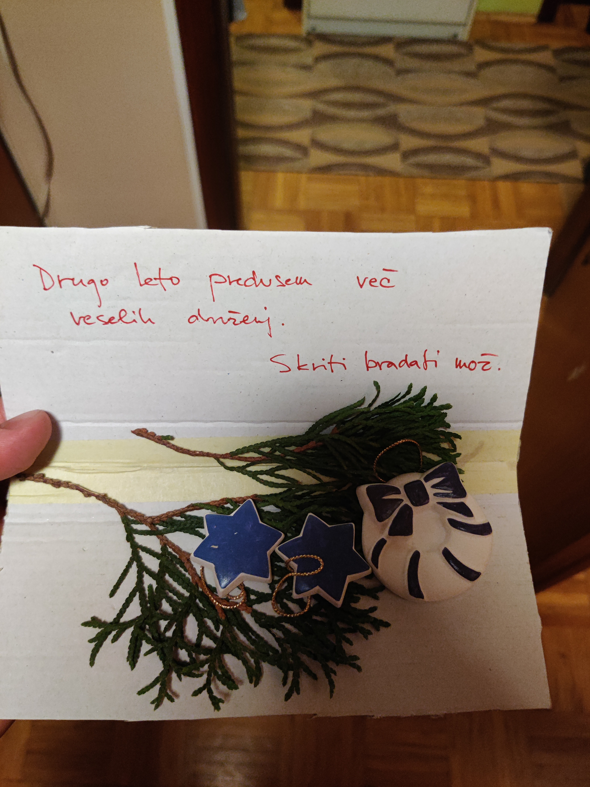

# DataScience Secret Santa 2020 - FINAL REPORTS
Hello everybody! 🙃
If you have noticed increased activity of postmen in your neighborhood, with 99% certainty we can say that's because you're just recieving your greeting cards/gifts for the 2020 Data Science Secret Santa  is almost due.🥳🎆🎇
However, if you have received your gifts early this year, and if you are willing to share with the rest of DataScience group, check out `upload_your_photos.md` to learn how to do it.
https://github.com/.../blob/master/upload_your_photos.md

Feel free to also edit this markdown file and add your photos below so we can aggregate them here!
Cheers!🥳

# YOUR REPORTS

## Slavko Zitnik
Thanks for organizing this and especially to the one who created and sent this card ;) 

## Erik Štrumbelj
Thanks to my Secret Santa for a wonderful gift! And to the organizers for their work!

Feedback:

* Rafaello: Great! (You know your audience!)
* Sure, they are only pie charts, but even they deserve better color choice!
* Packaging: Perfectly sized and robust!
* Text: Don't use "at least" with an interval (*at least 6-8* makes no sense; use *at least 6* instead).

## Andrej

Hey, my secret Santa, thanks so much! I really enjoyed your drawing of "not a pie chart" hehe ;) I hope you put me in the thinking outside the pie category! :P Merry Christmas and Happy Holidays!

## Greta

Hey Santa, I looove the card! I think DataScience@UL-FRI should consider adopting this new logo, at least every December. I like how your wishes reference the Mandalorian, but you really made me smile with the last page. :D Such a nice, personal touch. You must know me well! ;) Happy holidays!

## Jan

Hey, not-so-secret-Santa, thanks! I laughed my ass off at the drawing! :) I redacted your name so that you stay secret, I hope you don’t mind. Happy holidays!!!

## Patrik

Thanks to my secret santa! Very original card and gift! I am pretty sure it will become handy when coding or writing reports at night :) Merry Christmas y’all!

## Vid

Dear Santa! Thanks so much for the ornaments. I was thinking of not setting up a tree in my student flat this year, but this gift pipped the decision tree the other way! Have a merry Xmas! ❤️

## Žiga
Dear (secret) Santa! Thank you for the best wishes and for the lamp :P May the positive definiteness be with you too :) 
=======

# DataScience Secret Santa 2020 - FINAL REPORTS
Hello everybody! 🙃
If you have noticed increased activity of postmen in your neighborhood, with 99% certainty we can say that's because you're just recieving your greeting cards/gifts for the 2020 Data Science Secret Santa.🥳🎆🎇
However, if you have received your gifts early this year, and if you are willing to share with the rest of DataScience group, check out `upload_your_photos.md` to learn how to do it.
[Github collaboration instructions](https://github.com/VukMNE/DataScience-Secret-Santa/blob/master/upload_your_photos.md)

Or, you can upload them to this [Google Drive folder](https://drive.google.com/drive/folders/1im8frKGNGXJ_ngh-kfc6Lw01XRxRe6wV?usp=sharing).

Feel free to also edit this markdown file and add your photos below so we can aggregate them here!
Cheers!🥳

# YOUR REPORTS
